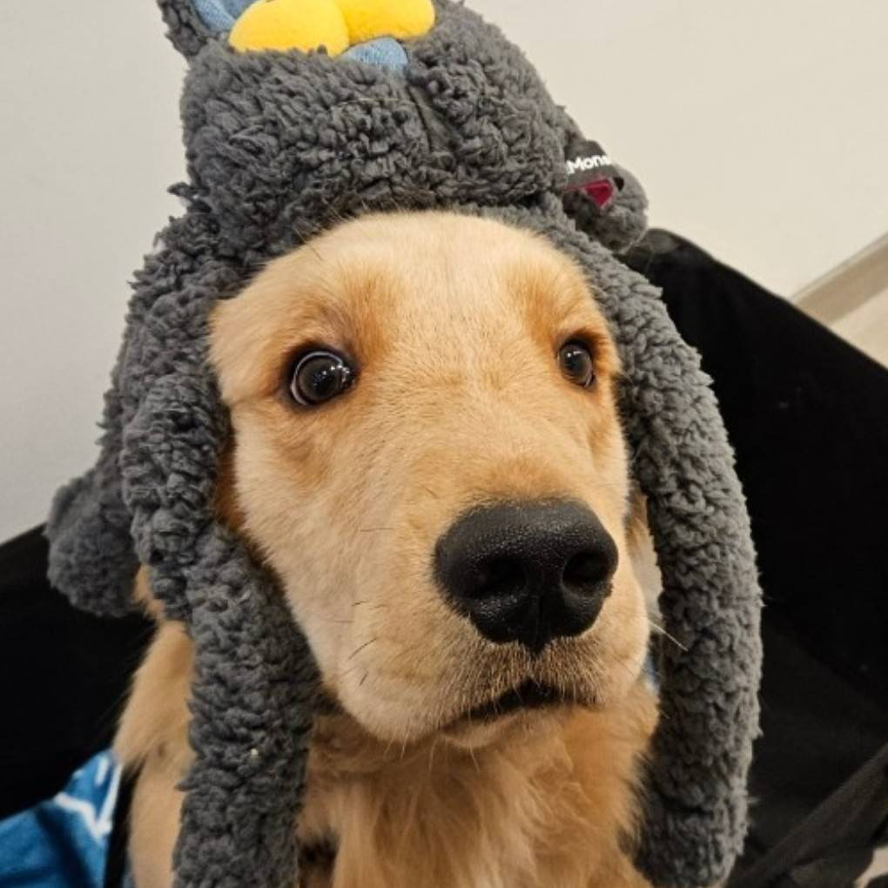

## Hi 👋

  
   
  
  
  
  
  
   
  👨🏽‍🚀🚀🐶🌟
   
  <samp>
    <a href="#">about</a> .
    <a href="#">projects</a>
  </samp>

<!--
**yuchen818/yuchen818** is a ✨ _special_ ✨ repository because its `README.md` (this file) appears on your GitHub profile.

Here are some ideas to get you started:

- 🔭 I’m currently working on ...
- 🌱 I’m currently learning ...
- 👯 I’m looking to collaborate on ...
- 🤔 I’m looking for help with ...
- 💬 Ask me about ...
- 📫 How to reach me: ...
- 😄 Pronouns: ...
- ⚡ Fun fact: ...
-->
